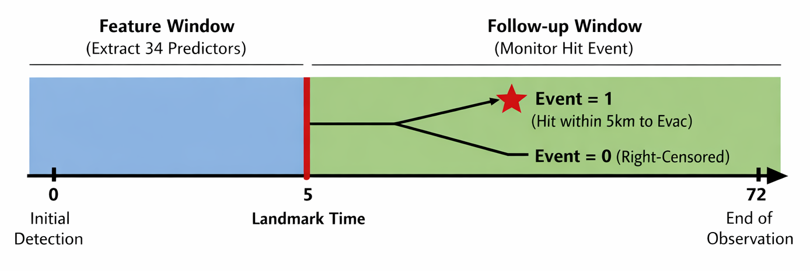

# Survival Analysis for Wildfire Evacuation

|                 |                                                                                     |
| --------------- | ----------------------------------------------------------------------------------- |
| **Domain**      | Survival analysis, wildfire risk modeling                                           |
| **Sample**      | 221 wildfire events (69 observed hits, 152 right-censored)                          |
| **Methods**     | Landmark survival design, Elastic Net Cox, log-logistic AFT, Random Survival Forest |
| **Stack**       | R · survival · survminer · glmnet · flexsurv · Python · scikit-survival             |
| **Data source** | WiDS 2026 Global Datathon (Kaggle)                                                  |
| **Context**     | UC Davis STA 260 paired project (2 members)                                         |

Can early wildfire behavior predict how soon a fire will approach an evacuation zone? 
Using a 5-hour landmark design, this project models conditional time-to-hit for wildfires approaching evacuation zones at 12, 24, 48, and 72 hours after ignition based on early-stage data. We use Cox-based feature screening and diagnostics to develop a primary log-logistic AFT model, with Random Survival Forest as a nonlinear sensitivity benchmark. 

**[Read the full course report (PDF)](paper/STA260_Wildfire_Survival.pdf)**

## Key Findings

- **Fire dynamics were more informative than static initial geometry.**
  Centroid movement speed was the most stable predictor in the final AFT model, while initial fire area was not significant after accounting for movement and directional information. For time-to-hit — as opposed to suppression or growth outcomes in prior work — how a fire moves matters more than how it starts.

- **The parsimonious AFT model offered a favorable interpretability–complexity tradeoff.**
  An 8-variable AFT model achieved cross-validated discrimination (C-index 0.755) comparable to a 17-variable RSF (0.767). With only 69 observed events, the sample cannot reliably distinguish whether the RSF's in-sample advantage reflects genuine nonlinear structure or sampling variability. Moreover, reducing from 17 to 8 variables produced nearly identical RSF cross-validated performance, suggesting that the core signal was preserved.

- **The observation process is itself informative.**
  A low-resolution detection flag emerged as one of the strongest predictors, likely reflecting differences in operational attention or underlying fire severity rather than measurement quality alone.

## Study Design



The analysis uses a 5-hour landmark: predictors summarize fire behavior observed during the first 5 hours after detection, and follow-up begins at the landmark. The event is a fire reaching within 5 km of an evacuation zone during follow-up; otherwise the observation is right-censored.

All reported probabilities are conditional on a fire remaining event-free through the 5-hour landmark.

## Feature Reduction

```text
34 raw predictors (fire growth, kinematics, direction, temporal, observation quality)
                |
                v
Exclude distance-based and distance-derived predictors (outcome-entangled)
                |
                v
23 predictors
                |
                v
Remove duplicate representations, apply cyclical encodings, consolidate observation flags
                |
                v
17-variable exploratory set
                |
                v
Retain interpretable, direction-relative, speed-based features
                |
                v
12-variable candidate set -> Elastic Net Cox (5-fold CV) -> 9 variables
                |
                v
Multivariable Cox diagnostics -> PH assumption violated
                |
                v
Switch to log-logistic AFT
                |
                v
Resolve collinearity + model comparison: radial growth vs. centroid speed, VIF > 100
                |
                v
Final 8-variable AFT model
                |
                v
RSF sensitivity analysis
```

## Target Leakage Audit: Excluding a Predictor That Mirrors the Outcome Definition

During early RSF exploration, the minimum-distance-to-evacuation-zone variable dominated feature importance (0.20 versus ≤ 0.003 for all other predictors), and its distribution perfectly separated event and censored observations. The event itself was defined using the same 5 km proximity threshold. Raw-data inspection confirmed anomalies: several fires with initial shortest distance already below 5 km were assigned long survival times, inconsistent with the threshold-based event definition.

Retaining these variables would reduce the task to a deterministic threshold rule and obscure the contribution of other early-stage fire characteristics. The final analysis excludes distance-based and distance-derived predictors by construction.

## Modeling Workflow

1. Inspect censoring, temporal patterns, skewed kinematic variables, and observation quality. 
2. Create cyclical hour/day-of-week encodings, log transforms, and a summer indicator.
3. Remove distance-derived features and redundant representations.
4. Use Elastic Net Cox regression for variable screening.
5. Test the proportional-hazards assumption with Schoenfeld residuals: four covariates violated. Rather than adding multiple time-varying coefficients or discretizing a continuous, heavily right-skewed survival time, we adopted a log-logistic AFT framework that models log survival time directly.
6. Compare parametric AFT distributions and fit a parsimonious log-logistic AFT model.
7. Evaluate internal discrimination and calibration.
8. Compare the AFT feature set with an expanded RSF benchmark as a sensitivity analysis.

[Methodology Notes](METHODOLOGY.md) shows rationale for landmarking, feature exclusion, model selection, and sensitivity analyses.
## Results

The jointly authored report selected an 8-variable log-logistic AFT model:

| Model | In-sample C-index | Mean 3-fold CV C-index | Apparent gap |
|---|---:|---:|---:|
| Log-logistic AFT, 8 variables | 0.774 | 0.755 | 0.019 |
| RSF, same 8 variables | 0.826 | 0.767 | 0.060 |
| RSF, expanded 17 variables | 0.825 | 0.767 | 0.057 |

The RSF models produced only a modest cross-validated improvement and a larger in-sample-to-CV gap, consistent with greater overfitting risk in this small sample. The broader 17-variable RSF did not outperform the reduced-feature RSF, suggesting that the primary reduction retained most predictive signal. This supports retaining the more interpretable AFT model as the primary framework, providing direct time-to-event interpretation.

## My Contributions

This was a paired UC Davis STA 260 project with Yichen Wang. My contributions:

- **Exploratory analysis and feature engineering:** Led EDA, constructed cyclical encodings, log transforms, and screening features.
- **Definition-based exclusion:** Identified the distance-variable anomaly through RSF exploration, verified it in raw data, and led the decision to exclude distance-derived predictors.
- **Elastic Net Cox screening and diagnostics:** Implemented Cox variable selection, conducted PH assumption testing with Schoenfeld residuals, and evaluated collinearity with VIF.
- **RSF sensitivity analysis:** Independently implemented the Python Random Survival Forest benchmark comparing 8-variable and 17-variable feature sets.
- **Report writing:** Led the introduction, discussion, and interpretation sections.

Yichen led the AFT framework design and implementation. 

## Repository Structure

```text
.
├── README.md
├── analysis/
│   └── wildfire_survival_analysis.Rmd
├── assets/
│   └── landmark-design.png
├── notebooks/
│   └── sensitivity_rsf.ipynb
├── data/
│   ├── README.md
│   └── data_dictionary.md
├── docs/
│   └── methodology_notes.md
├── paper/
│   └── STA260_Wildfire_Survival.pdf
└── requirements.txt
```

## Limitations

- Small analytic sample with 69 observed events and substantial right censoring.
- Single-dataset internal validation only; no external validation.
- No weather, terrain, vegetation, or regional context in the analytic feature set.
- Fixed landmark estimates conditional risk after 5 hours, not dynamic risk from ignition.

## Repository Scope

This is a methodology-focused portfolio case study. Competition row-level data are not redistributed; reproduction requires downloading the data from the [WiDS 2026 Kaggle page](https://www.kaggle.com/competitions/WiDSWorldWide_GlobalDathon26/data). The course report and collaborative R analysis are included with both authors' permission.

## Paper

The full course report is available at [paper/STA260_Wildfire_Survival.pdf](paper/STA260_Wildfire_Survival.pdf).

## Tools

R, survival, survminer, glmnet, flexsurv, Python, scikit-survival, pandas, NumPy, matplotlib.
